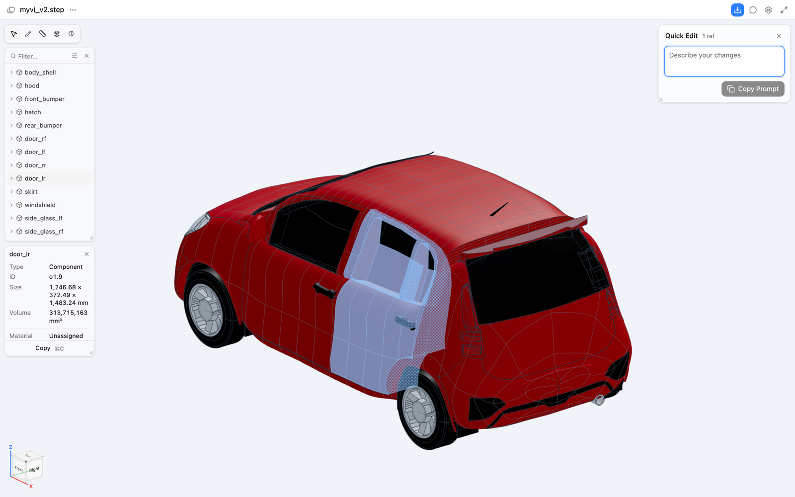
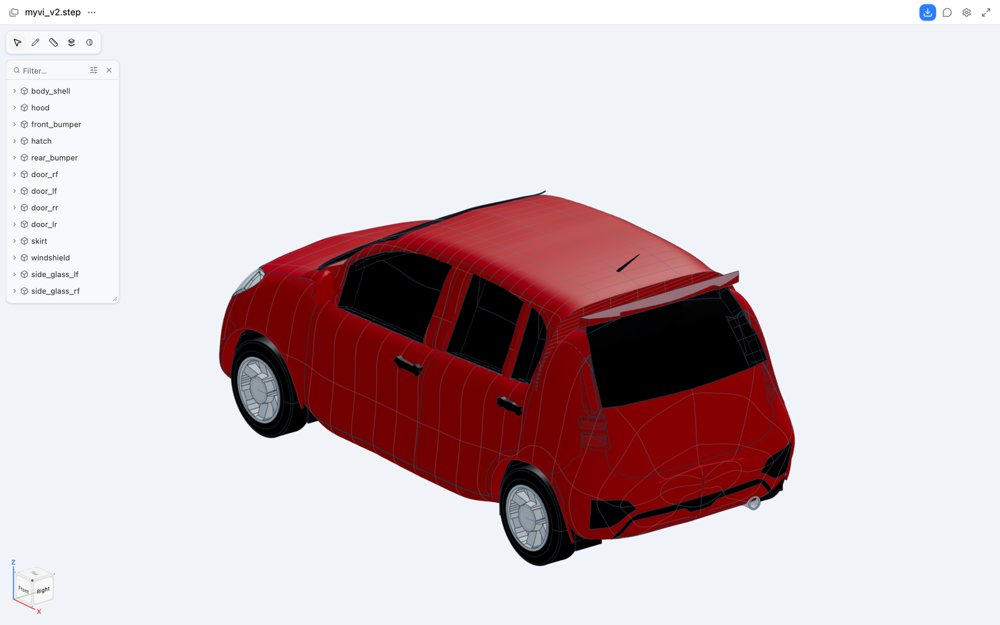
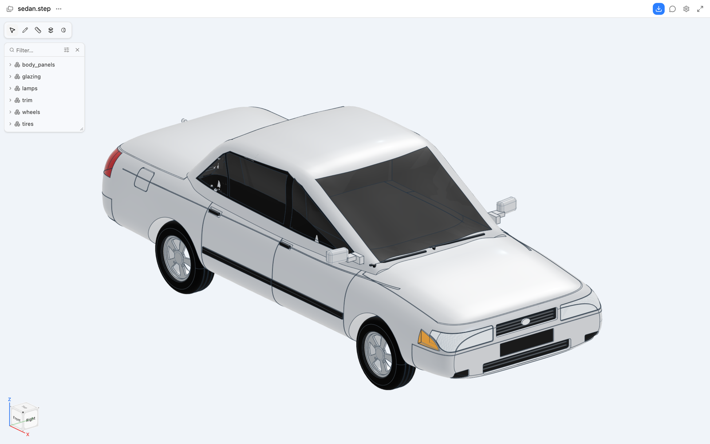
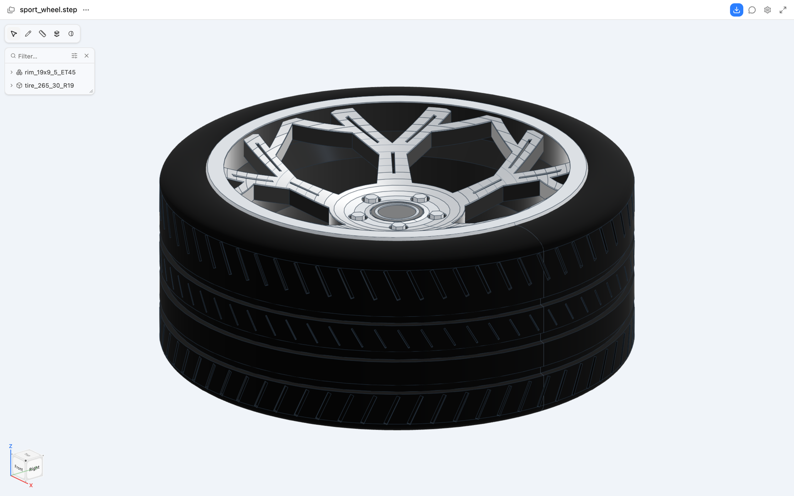
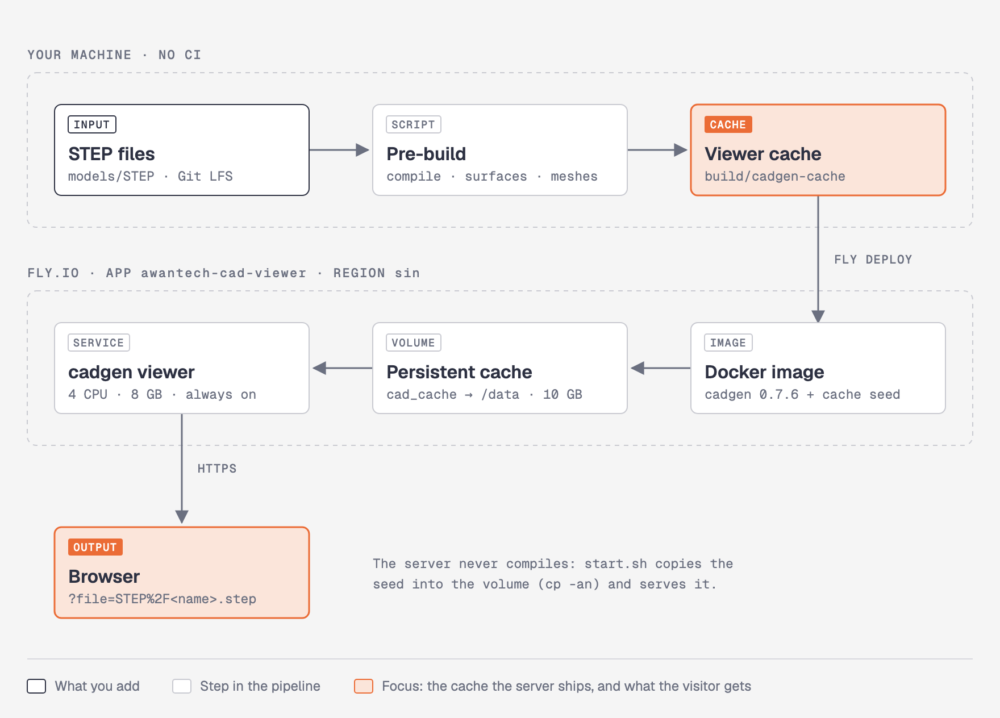

# Automotive CAD Model Preview

Open Awantech's automotive STEP models in a browser with a link. You can rotate the model, pick a part, read its size and volume, and copy a reference to it, without installing CAD software. The page runs the same CAD Viewer (`cadgen viewer`) you use locally, hosted on Fly.io.



## Why it exists

Reviewers outside the CAD team need to see a model before they comment on it: a client checking proportions, a supplier checking a wheel fit, a teammate on a phone. A screenshot hides the parts and the dimensions; a STEP attachment needs a CAD seat. This repo gives each model a URL that opens the real B-rep geometry, part tree and measurements in any modern browser.

## Example models

| Myvi v2 | Sedan | Sport wheel |
| --- | --- | --- |
|  |  |  |
| Five-door hatchback, 4.07 m body shell. Parts named by panel: `body_shell`, `hood`, `front_bumper`, `hatch`, four doors, `skirt` and each glass. | Four-door sedan grouped by system: `body_panels`, `glazing`, `lamps`, `trim`, `wheels`, `tires`. Ships with silver metallic paint, tinted glass and alloy materials. | Two parts named by spec: `rim_19x9_5_ET45` (19 × 9.5 in, ET45 offset) and `tire_265_30_R19`. Gloss black spokes with a machine-cut face. |
| [Open](https://awantech-cad-viewer.fly.dev/?file=STEP%2Fmyvi_v2.step) | [Open](https://awantech-cad-viewer.fly.dev/?file=STEP%2Fsedan.step) | [Open](https://awantech-cad-viewer.fly.dev/?file=STEP%2Fsport_wheel.step) |

## What you can do in the viewer

- **Rotate, pan and zoom** with the mouse or trackpad. The cube in the corner snaps to front, side and top views.
- **Select a part** in the 3D view or the part tree. The panel shows its type, reference ID (for example `o1.9`), bounding size in millimetres, volume and assigned material.
- **Copy a reference** such as `STEP/myvi_v2.step#o1.9` to point a teammate, or an AI agent with the CAD skill, at that exact part.
- **Quick Edit** collects a change request against the selected parts and copies it as a prompt.
- **Download** the STEP file from the toolbar.

## Open a model

URL format: `https://awantech-cad-viewer.fly.dev/?file=STEP%2F<name>.step`. The local viewer uses the same path, for example `http://127.0.0.1:3256/?file=STEP%2Fmyvi_v2.step`.

| Model | URL |
| --- | --- |
<!-- models:start -->
| `myvi_v2` | https://awantech-cad-viewer.fly.dev/?file=STEP%2Fmyvi_v2.step |
| `myvi` | https://awantech-cad-viewer.fly.dev/?file=STEP%2Fmyvi.step |
| `cybertruck` | https://awantech-cad-viewer.fly.dev/?file=STEP%2Fcybertruck.step |
| `sedan` | https://awantech-cad-viewer.fly.dev/?file=STEP%2Fsedan.step |
| `sport_wheel` | https://awantech-cad-viewer.fly.dev/?file=STEP%2Fsport_wheel.step |
| `wheel` | https://awantech-cad-viewer.fly.dev/?file=STEP%2Fwheel.step |
<!-- models:end -->

`scripts/add-step.sh` adds a row to this table for each new model.

## How it is built and served



1. `scripts/build.sh` runs on your machine. It compiles every STEP file, derives the surface data, and opens each model once in a headless browser so the meshes land in `build/cadgen-cache`.
2. `scripts/deploy.sh` ships that cache inside the Docker image. Fly.io builds the image remotely.
3. On start, `apps/viewer/start.sh` copies the seed into the `cad_cache` volume with `cp -an`, which keeps every entry already there, then starts `cadgen viewer`.
4. The server computes nothing at request time, so the first visitor gets the same load time as the hundredth. The cache never expires (`CADGEN_STORE_MAX=1000GB`) and survives restarts and redeploys.

## Add a model

```bash
scripts/add-step.sh ~/Downloads/new-part.step new_part
scripts/deploy.sh
git add -A && git commit -m "Add new_part" && git push
```

1. `add-step.sh` copies the file to `models/STEP/new_part.step`, copies its `.step.json` materials sidecar when one exists, and adds the URL row above.
2. `deploy.sh` rebuilds the cache and redeploys. Plan on about 5 minutes.
3. The commit stores the STEP file through Git LFS, since GitHub rejects plain files over 100 MB.

Names may contain letters, digits, `.`, `_` and `-`; the name becomes the URL.

## Run locally

```bash
pip install cadgen==0.7.6
scripts/dev.sh
```

Then open http://127.0.0.1:3256/?file=STEP%2Fmyvi_v2.step.

## Deploy

One-time setup:

```bash
fly auth login
uv venv -p 3.11 .venv && uv pip install -p .venv/bin/python "cadgen[snapshot]==0.7.6"
.venv/bin/python -m playwright install chromium
```

The Fly app lives in the Willstack.ai org (`willstack-ai-293`). Deploy with `scripts/deploy.sh`; it creates the app and the 10 GB cache volume on the first run and prints every model URL at the end. There is no CI: you deploy from your machine.

Remove the app after the demo:

```bash
scripts/teardown.sh
```

## Repository layout

```
models/STEP/   STEP files and their .step.json material sidecars (Git LFS)
apps/viewer/   Dockerfile, fly.toml and start.sh for the Fly app
scripts/       add-step.sh, build.sh (+ warm.py), deploy.sh, dev.sh, teardown.sh
cad/myvi/      build123d source for the Myvi models
build/         locally built viewer cache (git-ignored, copied into the image)
docs/          README images
```

To rebuild the Myvi STEP from source, install `cad/myvi/requirements.txt` and run `python cad/myvi/src/myvi_v2.py`. The source FBX stays out of the repo for licence reasons.

## Before you share the link

- The viewer has no login. Anyone with the URL can open and download the models. Tear the app down when the review ends.
- The machine runs around the clock (4 dedicated CPUs, 8 GB RAM, `auto_stop_machines = "off"`) so visitors never wait for a cold start. Fly bills it for every hour it exists.

## Related

[automotive-paint-bench](https://github.com/ChangWeiHong/automotive-paint-bench) renders these car models in modelled daylight and compares paint colours under two conditions side by side.
